# Akasha

**Your Vault as a navigable 3D universe.**

<p align="center">
  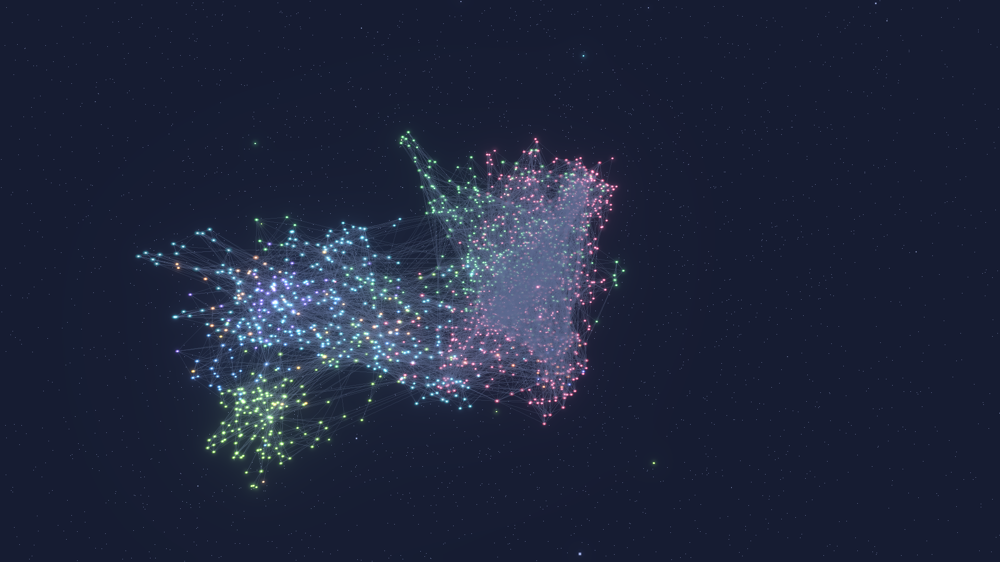
</p>

*Above: a vault of ~2,000 interlinked markdown files as a force-directed particle
galaxy. The layout engine builds the clusters from the links alone, with zero
configuration; each color is a knowledge domain, and the bright strands between
clusters are real cross-domain links.*

## Flythrough

<p align="center">
  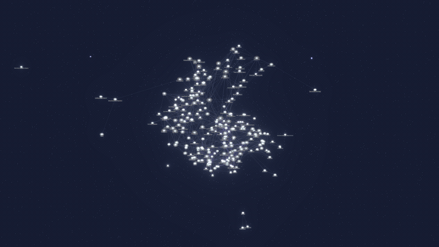
</p>

*Orbit the whole graph, then dive into a cluster; the note labels fade in as the
camera approaches. [Watch in HD (mp4).](assets/flythrough.mp4)*

## What it is

Akasha (Sanskrit: *ākāśa*, "the ether, the space that holds everything") scans any
**folder of Markdown files connected by links** and renders the link graph as an
interactive force-directed map in WebGL: rotate it, fly through it, read any note
without leaving the map. It reads both link styles: Obsidian `[[wiki links]]`
resolved by basename, and standard markdown links to `.md` files (`[text](path.md)`)
resolved by relative path. An Obsidian vault is the natural fit, but **Obsidian
itself is never required**: the only contract is markdown files in folders, and
deep links into Obsidian are an optional convenience.

## Why I made it

Obsidian renders vaults and notes in 2d. When visualizing large data sets, 3d visualizations are often needed for seeing patterns at scale or discovering intersections. Akasha seeks to solve that problem by providing the ability to traverse and visualize your second brain in a 3d navigatable space.  

## Reads Google's Open Knowledge Format

Point Akasha at an [Open Knowledge Format](https://cloud.google.com/blog/products/data-analytics/how-the-open-knowledge-format-can-improve-data-sharing/)
bundle — Google Cloud's open spec for markdown knowledge — and it renders like any
vault: concepts become nodes, the `[name](path.md)` links become edges, and the whole
bundle becomes a navigable 3D graph.

```bash
npx akasha-graph "C:/path/to/okf-bundle"
```

Akasha reads OKF frontmatter fully: each concept is labeled by its `title` (falling back
to the filename), and its `type`, `tags`, and `description` are carried into the graph.
Markdown links between concepts become the edges; the folder hierarchy becomes the
pillars.

## Quickstart

```bash
npx akasha-graph "C:/path/to/YourVault"     # scan, serve, open in one command
```

Or from a clone:

```bash
npm install
npm run scan -- "C:/path/to/YourVault" --exclude "Private/Drafts"
npm run build
npm start          # → http://localhost:5175
```

For development (hot reload): `npm run dev` and open http://localhost:5173.

### Desktop app

```bash
npm run desktop
```

Builds the frontend, bundles the Electron main process, and opens Akasha as a
native window with hardware acceleration unlocked (GPU rasterization,
zero-copy uploads, no GPU blocklist, `powerPreference: high-performance`). The
20k-link scene, bloom, and particles all render on the dedicated GPU.

Desktop conveniences: **File → Open Vault…** (`Ctrl+O`) opens a native folder
picker and scans the vault on the spot, with **File → Recent Vaults** listing
the ones you've opened before (including any opened from the CLI — both share
one registry); **Rescan Current Vault** (`Ctrl+Shift+R`) refreshes the graph
after you've added notes; the server binds a random localhost-only port.

## How it works

```
scanner/   walks the vault, resolves [[wiki links]] by basename (case-
           insensitive, like Obsidian) and standard [markdown](links.md) by
           relative path (the OKF link style), emits data/graph.json: nodes,
           links, pillars, degrees, phantom targets
server/    Express on localhost: /api/graph + /api/note (markdown read live
           from disk, path-confined to the vault root)
web/       Vite + TypeScript + three.js (3d-force-graph): the map, the reader
           panel, search, legend, focus mode
```

The scanner is vault-agnostic: point it at any Obsidian vault and the pillars,
colors, and clusters derive from your folder structure and your links.

### What it does

- **Navigate**: drag to rotate, scroll to zoom, right-drag to pan; arrow keys fly
  the camera (a tap nudges, holding accelerates to ~6× cruise, and speed scales
  with distance so long crossings are fast and close-in moves stay precise).
- **Search and fly**: press `/`, type, hit Enter; the camera travels to the top
  hit. The server builds a MiniSearch inverted index over note *content* (titles
  boosted, prefix + fuzzy matching) on first query; ~4 ms per query after that.
- **Read without leaving the map**: clicking a node opens the rendered Markdown in
  a draggable, resizable side panel; `[[wiki links]]` inside it are clickable and
  fly you to the next node. Double-click opens the note in Obsidian itself via
  the `obsidian://` URI.
- **Embedded files render inline**: `![[image.png]]` and ``
  resolve against the vault and render in place — images, video, audio, and PDF —
  alongside properly formatted tables and code fences that follow the active theme.
- **File explorer**: a left sidebar lists the whole vault as a collapsible tree,
  Obsidian style. Clicking a note selects its node and flies the camera there;
  clicking an image or clip previews it in the reader. Selecting a node from the
  graph or from search highlights the matching row, so the tree tracks where you
  are. Folder collapse state persists across sessions.
- **Focus mode**: selecting a node dims everything outside its depth-N
  neighborhood (depth 1–3, like Obsidian's local graph) and frames that whole
  neighborhood in view, choosing a camera angle that spreads the links across the
  screen rather than stacking them behind the node. How far the camera will swing
  to find that angle is yours to set: zoom only, rotation only, balanced, or best.
- **Switch vaults without restarting**: **File → Open Vault…** repoints the
  running app at another folder and scans it in place. Vaults you have opened
  before are listed underneath, so moving between them is one click. Each vault
  keeps its own scan cache and settled layout under `~/.akasha/`, so switching
  back is near-instant rather than a cold rescan, and each keeps the excludes it
  was scanned with. The desktop build uses a native folder picker; in the
  browser you paste a path.
- **Open Claude Code in the vault**: the button in the top-left corner opens a
  terminal running [Claude Code](https://claude.com/claude-code) with its working
  directory set to the vault currently on screen — the graph for finding what you
  want to change, a session already pointed at it for making the change. It
  follows the vault: switch vaults, and the button follows. Needs `claude` on
  your `PATH`; if it isn't, the terminal that opens says so.
- **Filters**: an ordered list of `show` / `ignore` rules decides which nodes
  render. Patterns match titles, tags, and folders by fuzzy text or wildcard
  (`macro*`, `*lipid`); `show` keeps matches (a whitelist), `ignore` hides them.
  The top rule wins, rules drag to reorder, and the list persists across sessions.
- **Your groups, your colors**: group nodes by top-level folder *or* by `#tag`;
  every legend swatch is a color picker, and clicking a legend row toggles that
  group's visibility.
- **Weighted node sizing**: node size reflects incoming links, outgoing links,
  and word count, each with its own weight slider, plus a contrast curve that
  exaggerates or flattens the spread between hubs and leaf notes.
- **Phantom nodes**: notes you've linked to but not yet written, rendered the way
  Obsidian renders unresolved links (off by default); an **orphans** toggle hides
  notes with no links.
- **Always-on labels, Obsidian style**: every node carries its name; labels fade
  in by camera distance, so names appear as you approach a cluster.
- **Deep links & sharing**: `?focus=`, `?theme=`, and `?nodes=` in the URL preset
  the view on load; **Tools → Copy Link to Selected Note** generates a shareable
  link to the current note.
- **Export & view**: File → **Export Image (PNG)** saves the current view; the
  View menu adds **Reset Camera** and **Toggle Fullscreen**.

### Built for massive vaults

Akasha holds the entire graph in view and stays interactive as vaults grow into
the thousands of notes. Below, the same vault from another angle, ~20k links,
every node and edge rendered at once:

<p align="center">
  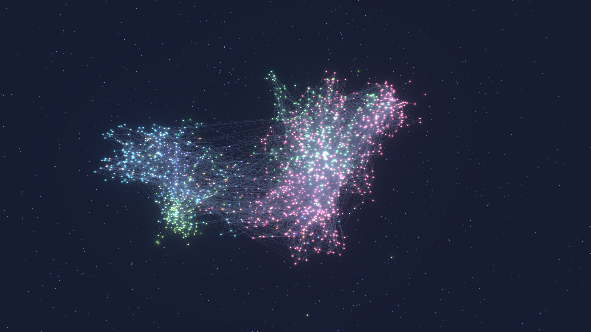
</p>

Akasha keeps rescan and render cost proportional to what changed:

- **Incremental rescans**: the scanner caches per-file parse results by mtime+size
  (`scan-cache.json`) and re-reads only the files that changed.
  Edit one note in a 2k-note vault: `108ms — 1 parsed, 1829 from cache`.
  At 50k notes the difference is seconds vs. minutes. `--full` forces a cold scan.
- **Content fingerprint**: a hash of the file manifest keys the layout cache,
  so a no-op rescan keeps your settled layout.
- **One-draw-call links**: all links render as a single merged `LineSegments`
  buffer; per-frame cost stays flat no matter how many links you have.
- **Label budget**: only the ~140 nearest labels draw per frame.
- **Lazy full-text index**: the server builds it once per session on first
  search; ~4 ms per query after that.

## Themes & node styles

Ten themes restyle the entire app (scene, links, starfield, bloom, node palette,
and UI panels), selectable from the bottom bar, the **View** menu, or `?theme=`
in the URL. Four node styles set how each note is drawn: **classic** glossy
spheres, faceted **dodecahedron** gems, glowing **starlight** cores, and
volumetric swirling **particle** shells (up to 16k points per node, tier-scaled),
selectable from the **nodes** dropdown or `?nodes=`.

Each shot below pairs a theme with a node style, so the first ten pictures cover
all ten themes and all four styles; the last two show tag grouping and the view
from inside a cluster:

<table>
  <tr>
    <td width="33%"><br><sub><b>Midnight</b>, classic spheres: cool dark default</sub></td>
    <td width="33%">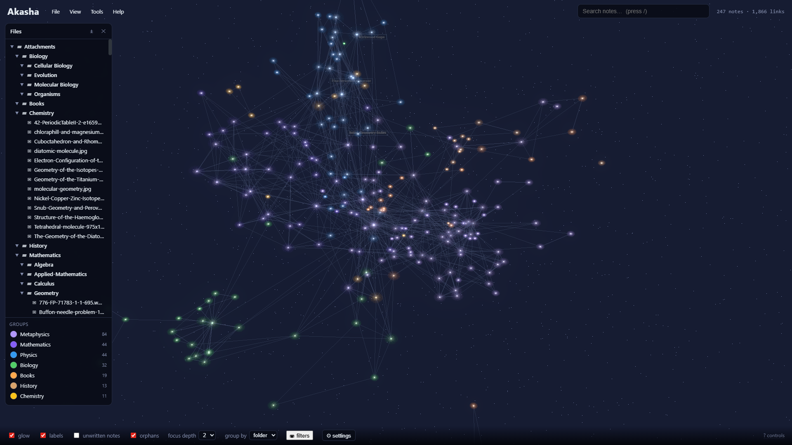<br><sub><b>Cosmos</b>, particles: deep space, dense starfield</sub></td>
    <td width="33%">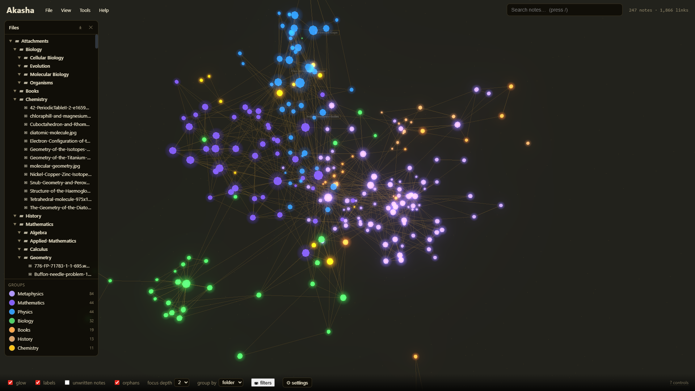<br><sub><b>Gilded</b>, starlight: near-black with gold links</sub></td>
  </tr>
  <tr>
    <td width="33%">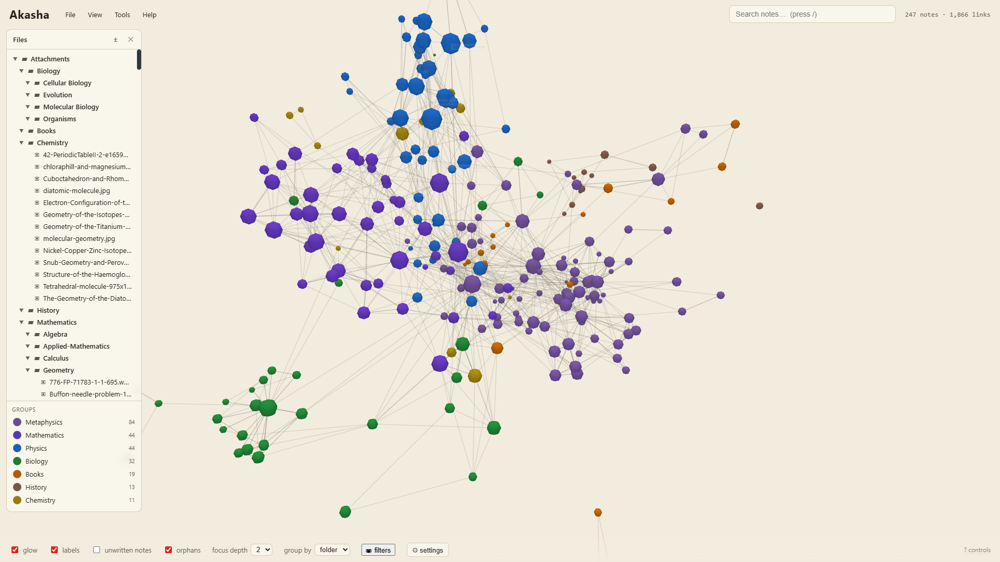<br><sub><b>Manuscript</b>, classic: light parchment</sub></td>
    <td width="33%">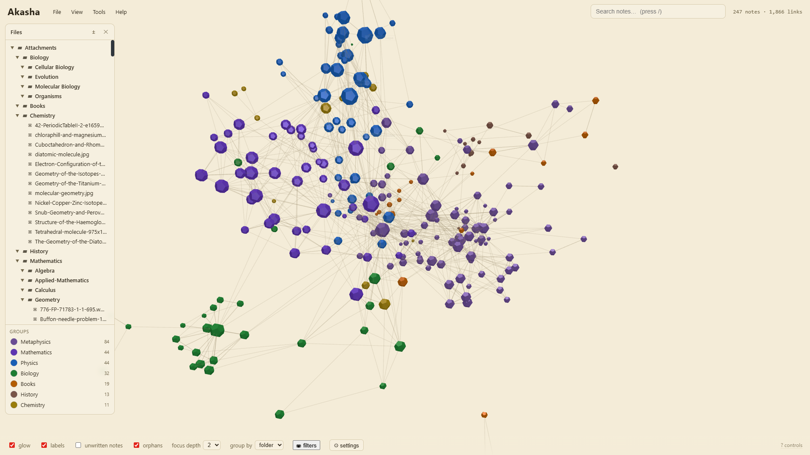<br><sub><b>Notebook</b>, dodecahedrons: warm beige paper</sub></td>
    <td width="33%">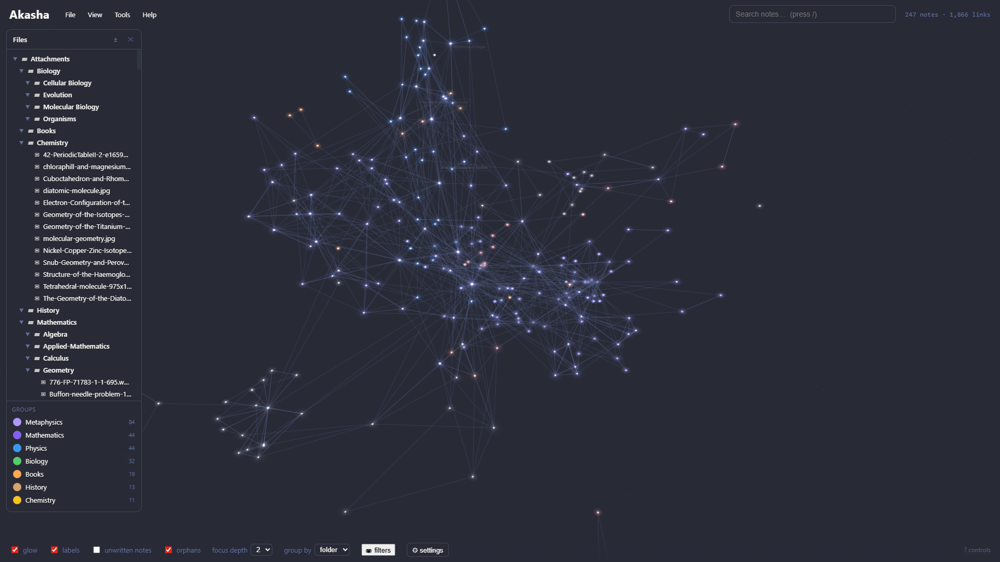<br><sub><b>Dracula</b>, particles: purple-charcoal</sub></td>
  </tr>
  <tr>
    <td width="33%">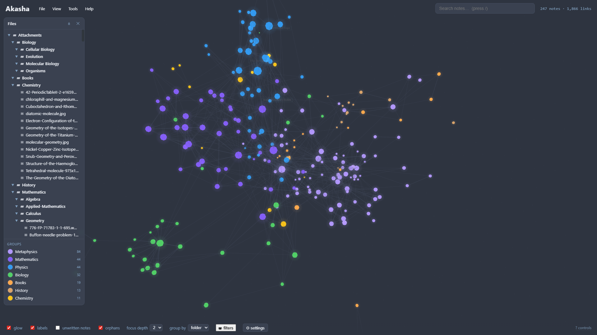<br><sub><b>Nord</b>, starlight: arctic slate-blue</sub></td>
    <td width="33%">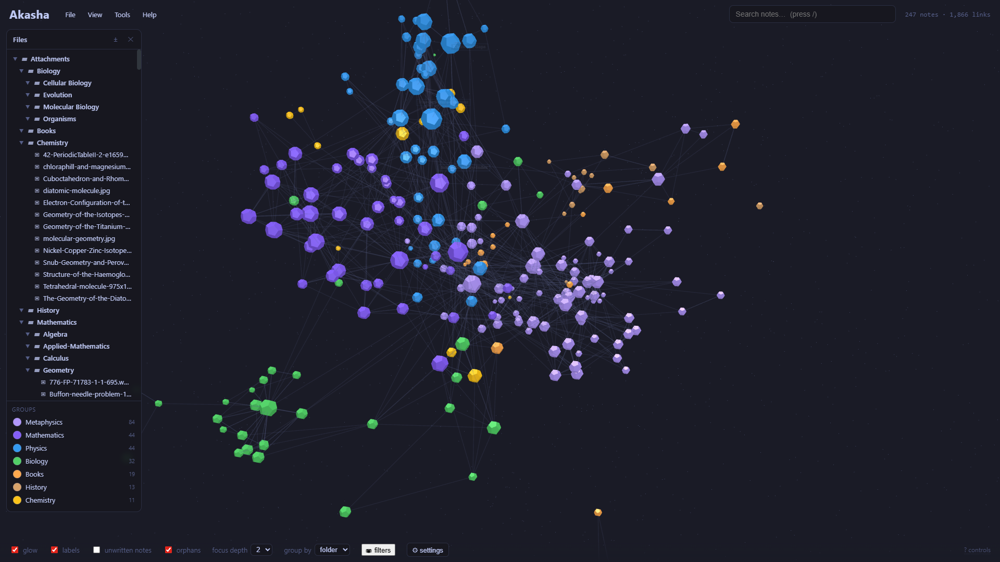<br><sub><b>Tokyo Night</b>, dodecahedrons: deep navy</sub></td>
    <td width="33%">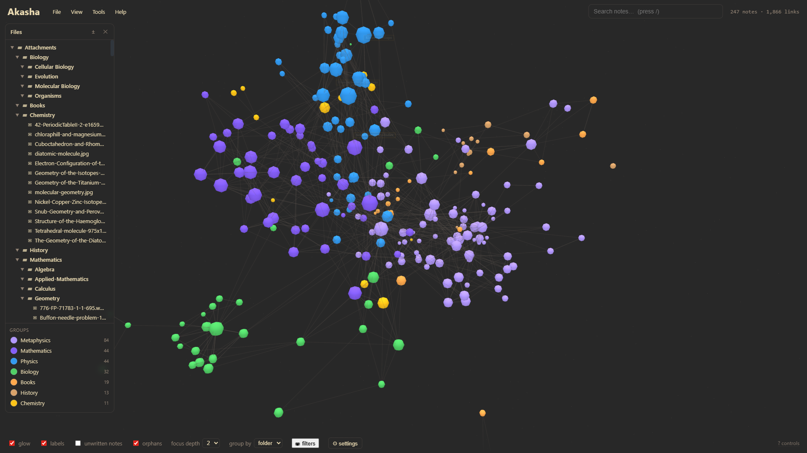<br><sub><b>Gruvbox</b>, classic: retro warm dark</sub></td>
  </tr>
  <tr>
    <td width="33%">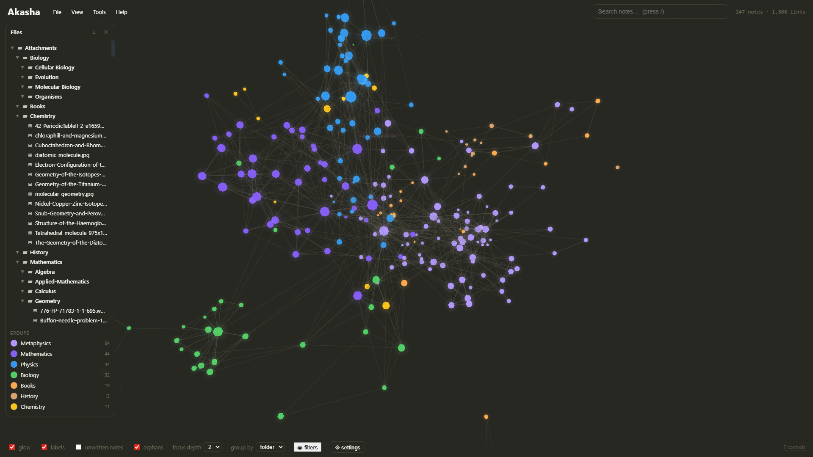<br><sub><b>Monokai</b>, starlight: classic editor olive</sub></td>
    <td width="33%">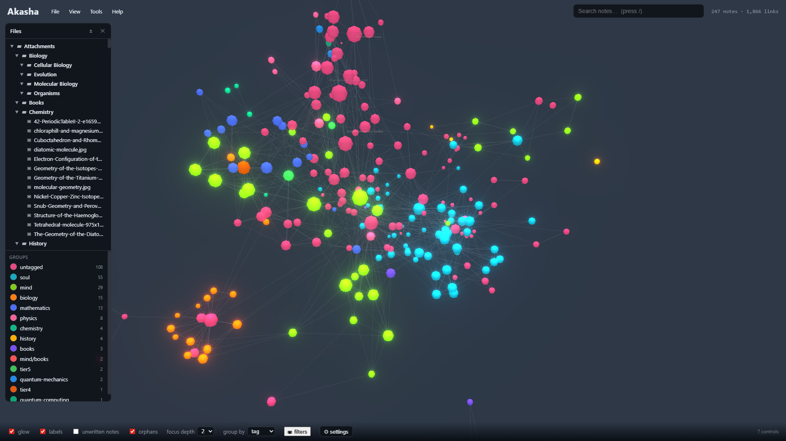<br><sub><b>Group by #tag</b>: your tags drive the legend and colors</sub></td>
    <td width="33%">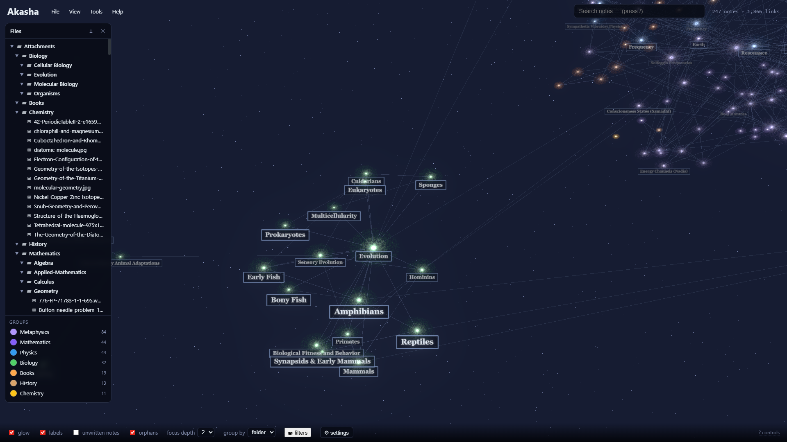<br><sub><b>Inside a cluster</b>: labels fade in as you approach</sub></td>
  </tr>
</table>

### Capabilities

A selected node opens the rendered note in a draggable, resizable reader panel
while focus mode dims everything outside its neighborhood:

<p align="center">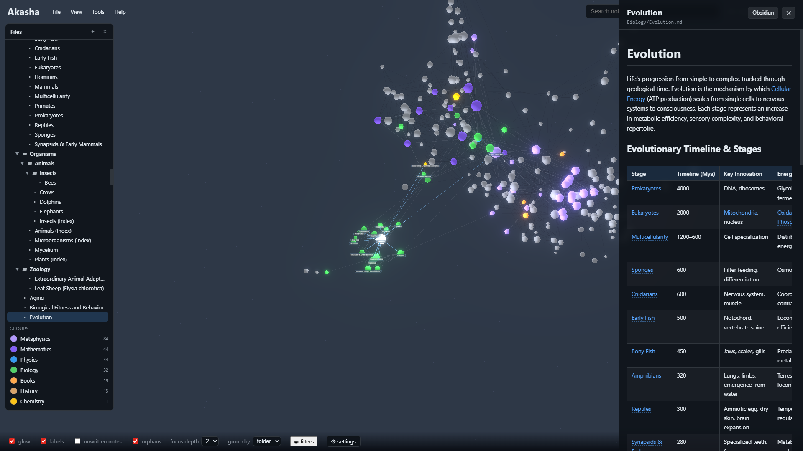</p>

The file explorer reaches a note by folder when you don't know where it sits in
the graph:

<p align="center">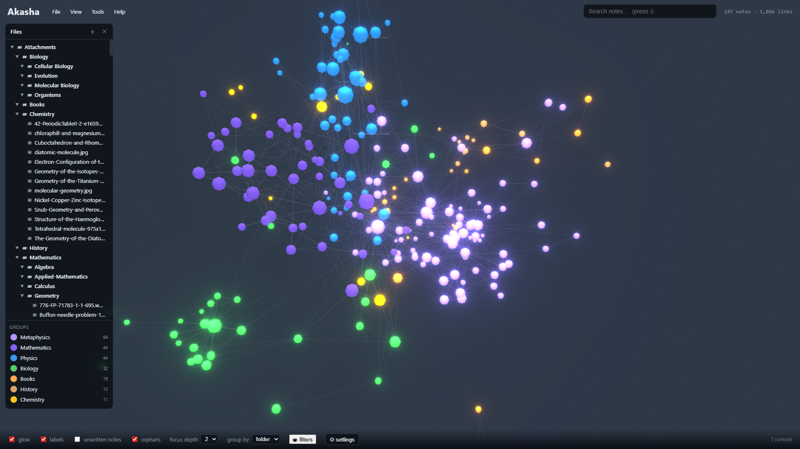</p>

Embedded files resolve against the vault and render in the reader where they sit
in the note — images, video, audio, and PDF — beside formatted tables and code
fences that follow the active theme:

<p align="center">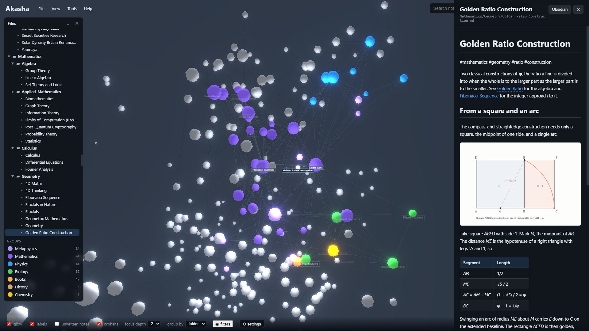</p>

Filters carve the graph down to what you want to see: an ordered list of
`show` / `ignore` rules matched against titles, tags, and folders by fuzzy text
or wildcard. The top rule wins, rows drag to reorder, and the list persists:

<p align="center">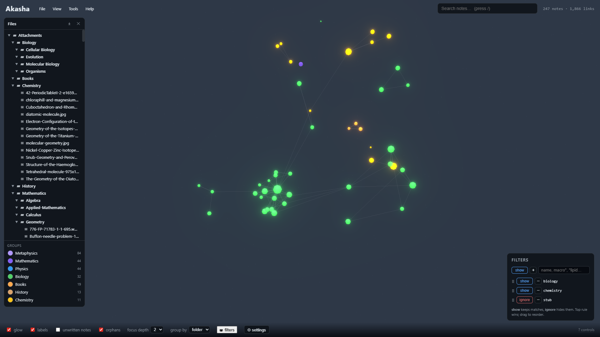</p>

**File → Open Vault…** points the running app at a different folder without a
restart. Every vault opened before is listed with its note count, and each keeps
its own scan cache and settled layout, so switching back is near-instant:

<p align="center">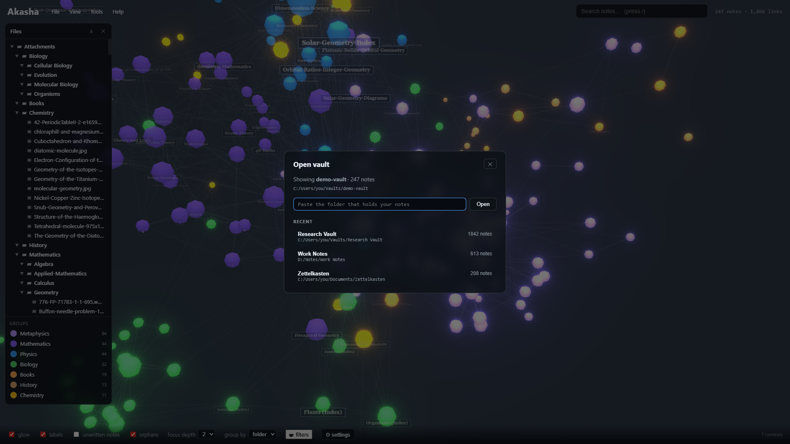</p>

<table>
  <tr>
    <td width="50%">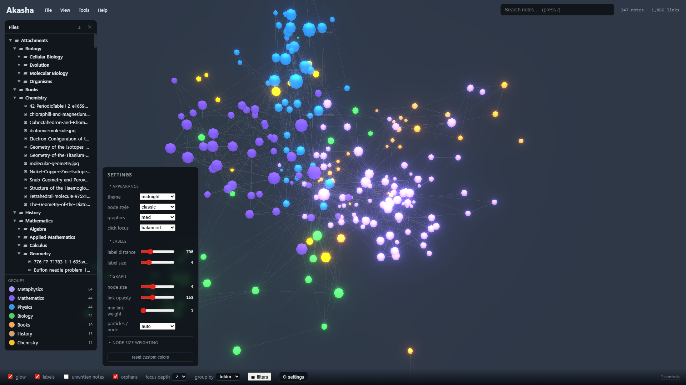<br><sub>⚙ <b>Display settings</b>: collapsible Appearance / Labels / Graph sections + node-size weighting</sub></td>
    <td width="50%">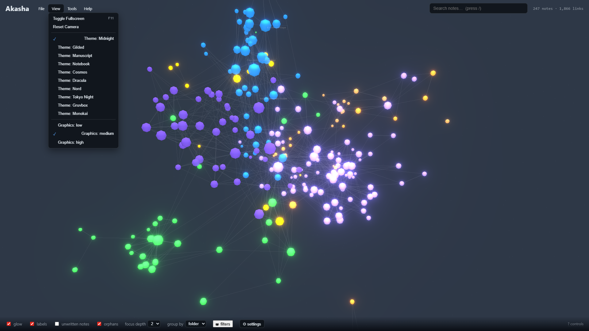<br><sub><b>View menu</b>: themes + graphics tiers</sub></td>
  </tr>
</table>

## Controls

| Input | Action |
|-------|--------|
| Left-drag | Rotate |
| Scroll | Zoom |
| Right-drag | Pan |
| Arrow keys | Fly: `↑` forward, `↓` back, `←`/`→` strafe |
| `Shift`+arrows | Pan |
| `+` / `−` | Zoom |
| Hover | Highlight node + neighbors |
| Click | Select, fly to node, open reader |
| Double-click / right-click | Open the note in Obsidian |
| `/` | Focus search (`Enter` flies to the top hit) |
| `Esc` | Close modal / menu, then clear selection |
| Sidebar row | Click a note to fly to it; click an image/clip to preview it |
| Sidebar folder | Click to collapse or expand (remembered between sessions) |

The bottom bar carries the everyday toggles (glow, labels, unwritten/orphan nodes,
focus depth, group-by). The **⚙ settings** panel groups everything else into
collapsible sections — Appearance (theme, node style, graphics tier, click-focus
framing), Labels, Graph, and node-size weighting. **Help → Keyboard & Mouse
Controls** lists every input.

## Privacy

Everything runs on `localhost`. Data and files are never copied, indexed, or uploaded.

## Stack

TypeScript end to end · [3d-force-graph](https://github.com/vasturiano/3d-force-graph)
(three.js/WebGL) · Express 5 · Vite 6 · marked · tsx · 
Made with Claude Fable 5.

## License

MIT. See [THIRD_PARTY_LICENSES.md](THIRD_PARTY_LICENSES.md).
